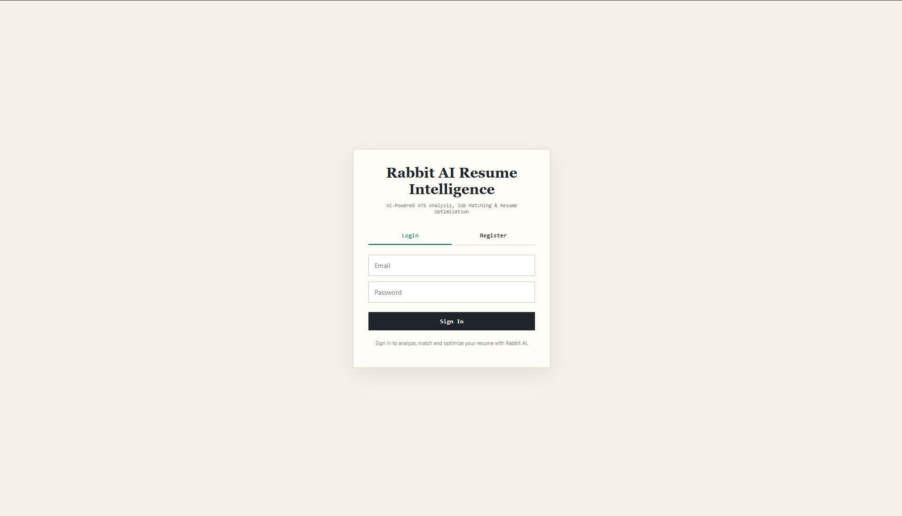
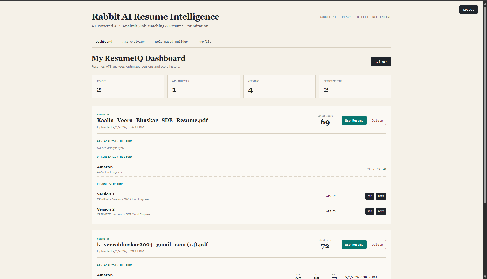
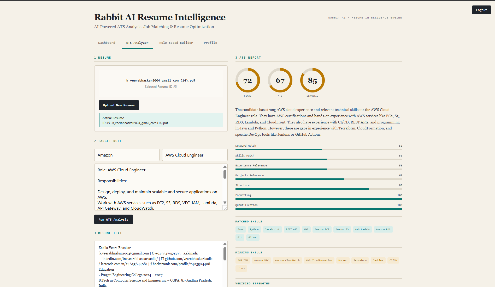
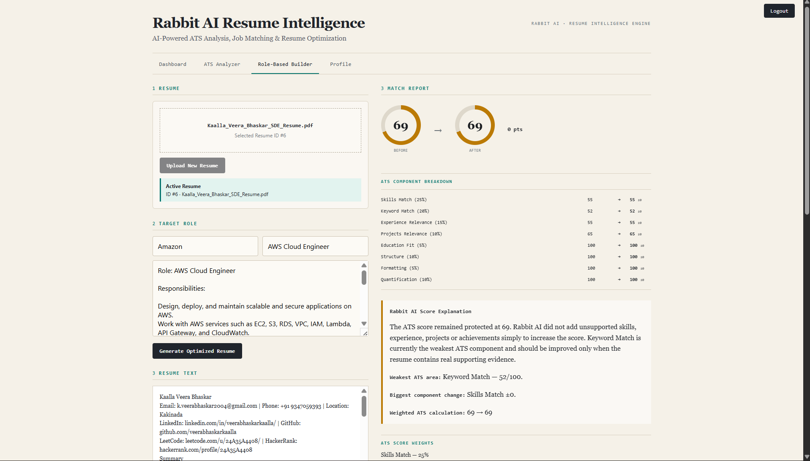
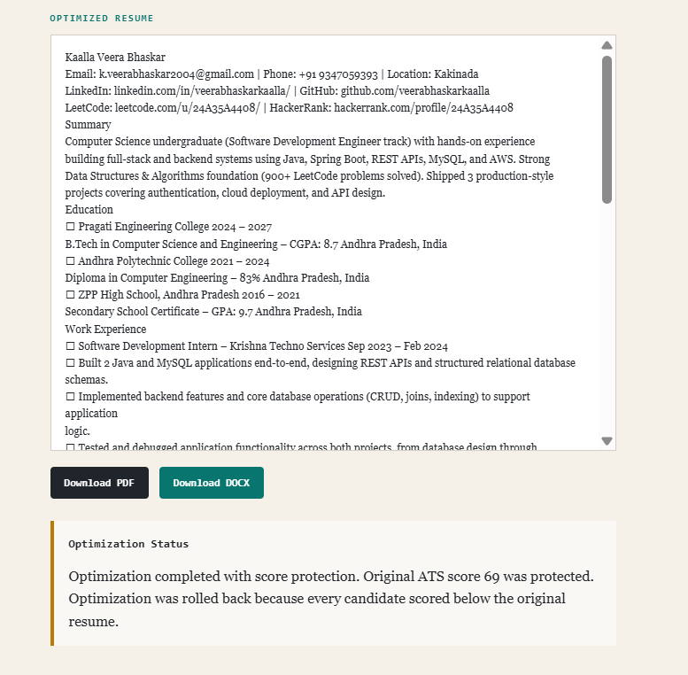
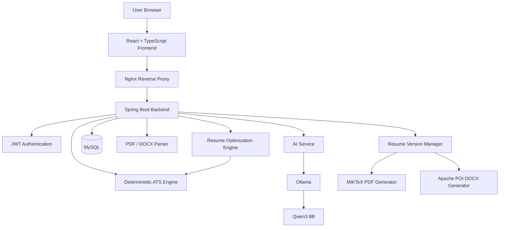
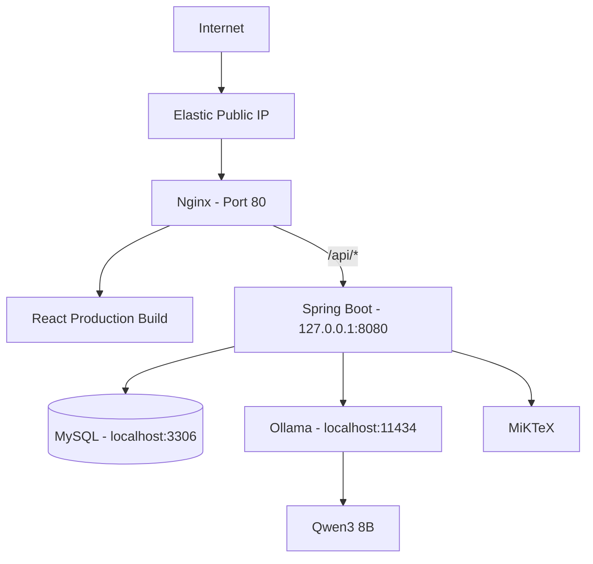

<div align="center">

# 🐇 Rabbit AI Resume Intelligence

### AI-Powered ATS Analysis, Job Matching & Resume Optimization

<p>
  <strong>Analyze resumes. Match job descriptions. Optimize content. Generate ATS-friendly resumes.</strong>
</p>

<p>
  
  
  
  
  
  
</p>

<p>
  <a href="http://3.109.134.223">
    <strong>🚀 Live Application</strong>
  </a>
</p>

</div>

---

## 📌 Overview

**Rabbit AI Resume Intelligence** is a full-stack AI-powered resume analysis and optimization platform.

The application evaluates a candidate's resume against a target job description using a combination of:

- Deterministic ATS scoring
- Keyword matching
- Skill matching
- Experience relevance
- Project relevance
- Resume structure analysis
- Formatting analysis
- Quantification analysis
- AI-powered semantic job matching
- Evidence-grounded resume optimization

Unlike simple keyword-checking tools, Rabbit AI combines a traditional ATS engine with a local Large Language Model to understand the semantic relationship between a resume and a job description.

The system is designed to optimize resumes while preventing AI hallucinations such as fabricated skills, experience, certifications, projects, or metrics.

---

## ✨ Key Features

### 📄 Resume Upload & Parsing

Users can upload:

- PDF resumes
- DOCX resumes

The backend automatically extracts and processes the resume content.

---

### 🎯 ATS Resume Analysis

Rabbit AI calculates multiple ATS components:

| Component | Weight |
|---|---:|
| Skills Match | 25% |
| Keyword Match | 20% |
| Experience Relevance | 15% |
| Projects Relevance | 10% |
| Education Fit | 5% |
| Resume Structure | 10% |
| Formatting | 5% |
| Quantification | 10% |

The result provides a detailed ATS compatibility report instead of only showing a single score.

---

### 🤖 AI Semantic Job Matching

Rabbit AI uses:

**Qwen3 8B through Ollama**

to understand semantic similarities between:

```text
Candidate Resume
        +
Target Company
        +
Target Role
        +
Job Description
```

The AI identifies:

- Candidate strengths
- Resume gaps
- Relevant experience
- Relevant projects
- Job-specific suggestions
- Semantic match score

---

### 🧠 Hybrid ATS Intelligence

The final job compatibility score combines:

```text
Deterministic ATS Score
          +
AI Semantic Match
          ↓
Final Compatibility Score
```

Current scoring strategy:

```text
75% ATS Engine
25% Semantic AI
```

This provides both deterministic resume evaluation and contextual AI understanding.

---

### 🛡️ Hallucination-Safe Optimization

Rabbit AI follows strict evidence-based optimization rules.

The AI is not allowed to invent:

- Skills
- Technologies
- Companies
- Work experience
- Projects
- Certifications
- Achievements
- Responsibilities
- Numbers
- Percentages
- Performance metrics

Unsupported job-description skills are shown separately instead of being inserted into the resume.

---

### ⚡ Resume Optimization

Rabbit AI can improve:

- Professional summary
- Experience bullet points
- Project bullet points
- ATS terminology
- Skills highlighting
- Action verbs
- Job-specific wording

while preserving the candidate's original facts.

---

### 🔒 ATS Score Protection

Optimized resumes are validated again using the ATS engine.

Rabbit AI prevents an optimized version from silently degrading the original ATS score.

```text
Original Resume
      ↓
AI Optimization
      ↓
ATS Re-Scoring
      ↓
Score Protection
      ↓
Final Optimized Resume
```

---

### 📊 Dashboard & History

The user dashboard displays:

- Uploaded resumes
- ATS analysis history
- Target companies
- Target roles
- ATS scores
- AI semantic scores
- Final scores
- Resume versions
- Optimization history

---

### 📚 Resume Version Management

Rabbit AI stores multiple versions of a resume.

Example:

```text
Version 1
Original Resume

Version 2
Optimized for Amazon AWS Cloud Engineer

Version 3
Optimized for another target role
```

Users can export any saved version.

---

### 📥 PDF & DOCX Export

Rabbit AI supports:

```text
Optimized Resume
       ↓
 ┌─────────────┐
 │             │
PDF           DOCX
 │             │
MiKTeX      Apache POI
```

The generated files are designed to remain ATS-friendly.

---

### 🔗 Clickable Resume Links

Generated resumes can preserve profile links such as:

- LinkedIn
- GitHub
- LeetCode
- HackerRank
- Portfolio

---

### 🔐 Authentication

Rabbit AI provides user authentication using:

```text
Spring Security
      +
JWT Authentication
```

Features include:

- User registration
- Login
- Token authentication
- Protected APIs
- Logout
- User profile
- Password update

---

# 🖥️ Application Preview

Create this folder inside the repository:

```text
docs/images/
```

Add your application screenshots there.

Recommended files:

```text
docs/images/login.png
docs/images/dashboard.png
docs/images/ats-analysis.png
docs/images/optimization.png
docs/images/resume-export.png
```

Then GitHub will display them like this:

---

<div align="center">

### Login



</div>

---

<div align="center">

### Dashboard



</div>

---

<div align="center">

### ATS Analyzer



</div>

---

<div align="center">

### AI Resume Optimization



</div>

---

<div align="center">

### Resume Export



</div>

---

# 🏗️ System Architecture



---

# 🔄 Application Workflow

```text
User Registration / Login
            ↓
Upload Resume
            ↓
PDF / DOCX Parsing
            ↓
Enter Target Company
            ↓
Enter Target Role
            ↓
Paste Job Description
            ↓
Deterministic ATS Analysis
            ↓
Qwen3 Semantic Analysis
            ↓
Hybrid Compatibility Score
            ↓
Strengths / Gaps / Suggestions
            ↓
AI Resume Optimization
            ↓
Hallucination Validation
            ↓
ATS Re-Scoring
            ↓
Score Protection
            ↓
Save Resume Version
            ↓
Download PDF / DOCX
```

---

# 🧰 Technology Stack

| Layer | Technology |
|---|---|
| Frontend | React |
| Language | TypeScript |
| Build Tool | Vite |
| Backend | Spring Boot |
| Language | Java |
| Database | MySQL |
| Security | Spring Security + JWT |
| ORM | Spring Data JPA / Hibernate |
| AI Runtime | Ollama |
| AI Model | Qwen3 8B |
| PDF Parsing | Apache PDFBox |
| DOCX Processing | Apache POI |
| PDF Generation | MiKTeX / pdfLaTeX |
| Web Server | Nginx |
| Cloud | AWS EC2 |
| Operating System | Ubuntu Linux |
| Deployment | systemd + Nginx |

---

# 🗂️ Project Structure

```text
ResumeIQ
│
├── frontend
│   │
│   ├── src
│   │   ├── App.tsx
│   │   ├── api.ts
│   │   ├── AuthGate.tsx
│   │   ├── DashboardPanel.tsx
│   │   ├── ProfilePanel.tsx
│   │   └── types.ts
│   │
│   ├── package.json
│   └── vite.config.ts
│
├── src
│   └── main
│       ├── java
│       │   └── com.resumeiq
│       │       │
│       │       ├── ai
│       │       ├── ats
│       │       ├── config
│       │       ├── controller
│       │       ├── document
│       │       ├── dto
│       │       ├── entity
│       │       ├── exception
│       │       ├── repository
│       │       ├── security
│       │       ├── service
│       │       └── util
│       │
│       └── resources
│           └── application.properties
│
├── docs
│   └── images
│
├── pom.xml
└── README.md
```

---

# ⚙️ Prerequisites

Install the following before running the project locally.

```text
Java 21
MySQL
Node.js
npm
Ollama
Qwen3:8b
MiKTeX
Git
```

---

# 🚀 Running the Project Locally

## 1. Clone the Repository

```bash
git clone YOUR_GITHUB_REPOSITORY_URL
```

Enter the project:

```bash
cd ResumeIQ
```

---

## 2. Configure MySQL

Open MySQL:

```sql
CREATE DATABASE resumeiq;
```

Default local configuration:

```text
Database: resumeiq
Username: root
Password: root
Port: 3306
```

You can also provide the database configuration through environment variables.

---

## 3. Install Ollama

Install Ollama from:

```text
https://ollama.com
```

Verify:

```bash
ollama --version
```

---

## 4. Download Qwen3 8B

```bash
ollama pull qwen3:8b
```

Verify:

```bash
ollama list
```

You should see:

```text
qwen3:8b
```

Test the model:

```bash
ollama run qwen3:8b
```

---

## 5. Configure MiKTeX

Install MiKTeX and verify that `pdflatex` is available.

```bash
pdflatex --version
```

Rabbit AI uses MiKTeX for generating professional PDF resumes.

---

## 6. Start Spring Boot Backend

From the project root:

### Windows

```bash
.\mvnw.cmd spring-boot:run
```

Or build the application:

```bash
.\mvnw.cmd clean package
```

Then:

```bash
java -jar target/resumeiq-0.0.1-SNAPSHOT.jar
```

Backend starts at:

```text
http://localhost:8080
```

---

## 7. Start React Frontend

Open another terminal:

```bash
cd frontend
```

Install dependencies:

```bash
npm install
```

Start development server:

```bash
npm run dev
```

Frontend starts using the Vite development server.

---

# 🔧 Environment Variables

Production configuration can be provided using environment variables.

```env
DB_URL=jdbc:mysql://localhost:3306/rabbit_ai
DB_USERNAME=your_database_user
DB_PASSWORD=your_database_password

OLLAMA_BASE_URL=http://localhost:11434
OLLAMA_MODEL=qwen3:8b

JWT_SECRET=your_secure_jwt_secret
JWT_EXPIRATION_MS=86400000

SERVER_PORT=8080
SERVER_ADDRESS=127.0.0.1

SHOW_SQL=false
```

> Never commit real production passwords, JWT secrets, `.env` files, or private keys to GitHub.

---

# 🌐 Production Deployment Architecture

Rabbit AI is deployed on AWS.



---

# ☁️ AWS Deployment

The production system currently uses:

```text
AWS Region:
Asia Pacific - Mumbai

Compute:
Amazon EC2

Operating System:
Ubuntu Linux

Web Server:
Nginx

Backend:
Spring Boot

Database:
MySQL

AI Runtime:
Ollama

AI Model:
Qwen3 8B

Resume PDF Engine:
MiKTeX

Static Frontend:
React Production Build
```

---

# 🔐 Production Security Architecture

Only the required public ports should be exposed:

```text
22  → SSH
80  → HTTP
443 → HTTPS
```

Internal services remain private:

```text
8080  → Spring Boot
3306  → MySQL
11434 → Ollama
```

Production request flow:

```text
Internet
   ↓
Nginx
   ↓
/api/*
   ↓
Spring Boot
   ↓
MySQL / Ollama / MiKTeX
```

---

# 🧠 ATS Engine

Rabbit AI's deterministic ATS engine evaluates several resume characteristics independently.

```text
Skills
Keywords
Experience
Projects
Education
Structure
Formatting
Quantification
```

This allows users to understand why their resume received a particular score instead of receiving an unexplained number.

---

# 🤖 AI Engine

Rabbit AI uses a local AI runtime.

```text
Spring Boot
     ↓
AiService
     ↓
OllamaAiService
     ↓
Ollama
     ↓
Qwen3 8B
```

Benefits:

- No paid LLM API dependency
- Local model execution
- Greater control over prompts
- Structured JSON responses
- Privacy-oriented architecture
- No third-party API token required

---

# 🛡️ AI Safety Strategy

Before accepting optimized content, Rabbit AI protects factual integrity.

```text
Original Resume Facts
        ↓
AI Candidate
        ↓
Evidence Validation
        ↓
Hallucination Guard
        ↓
ATS Re-Scoring
        ↓
Protected Resume Version
```

The AI is used as an assistant, while deterministic Java validation remains responsible for enforcing important constraints.

---

# 📊 Example Analysis

Example target:

```text
Company:
Amazon

Role:
AWS Cloud Engineer
```

Example report:

```text
ATS Score
AI Semantic Score
Final Match Score

Matched Skills
Missing Skills
Strengths
Gaps
Relevant Experience
Relevant Projects
Improvement Suggestions
```

---

# 📄 Resume Export Pipeline

```text
Structured Resume
       ↓
Resume Renderer
       ↓
 ┌──────────────┐
 │              │
PDF            DOCX
 │              │
MiKTeX       Apache POI
 │              │
ATS-Friendly Resume
```

---

# 🧪 Testing

Recommended application testing flow:

```text
Register
   ↓
Login
   ↓
Upload PDF / DOCX Resume
   ↓
Run ATS Analysis
   ↓
Verify AI Semantic Analysis
   ↓
Optimize Resume
   ↓
Verify Score Protection
   ↓
Download PDF
   ↓
Download DOCX
   ↓
Check Dashboard History
   ↓
Check Profile
```

---

# 🎯 Project Objectives

Rabbit AI was developed to demonstrate practical implementation of:

- Full-stack application development
- REST API architecture
- Spring Boot backend engineering
- React frontend development
- Database design
- JWT authentication
- AI integration
- Local LLM deployment
- Prompt engineering
- ATS scoring algorithms
- Document parsing
- PDF generation
- DOCX generation
- Cloud deployment
- Linux server administration
- Nginx reverse proxy
- AWS infrastructure

---

# 🔮 Future Enhancements

Possible future improvements include:

```text
HTTPS + Custom Domain
Multiple AI model selection
Resume template selection
Job recommendation engine
Skill-gap learning roadmap
AI interview preparation
Resume comparison
Application tracking
Advanced analytics
GPU inference deployment
Fine-tuned resume intelligence model
```

---

# ⚠️ Important Note

Rabbit AI's ATS score is a **predictive compatibility score** generated by this application's scoring engine.

It is not an official score from any specific commercial Applicant Tracking System.

Different ATS platforms may use different parsing, ranking, and filtering algorithms.

---

# 👨‍💻 Author

<div align="center">

### Veera Bhaskar Kaalla

Computer Science & Engineering

Backend • Cloud • AI • Full-Stack Development

<p>
  <a href="https://www.linkedin.com/in/veerabhaskarkaalla/">LinkedIn</a>
  &nbsp; • &nbsp;
  <a href="https://github.com/veerabhaskarkaalla">GitHub</a>
  &nbsp; • &nbsp;
  <a href="https://leetcode.com/u/24A35A4408/">LeetCode</a>
</p>

</div>

---

<div align="center">

## ⭐ Support the Project

If you found Rabbit AI Resume Intelligence useful or interesting, consider giving the repository a ⭐.

### 🐇 Rabbit AI Resume Intelligence

**Build smarter resumes. Understand job compatibility. Optimize with evidence.**

</div>
